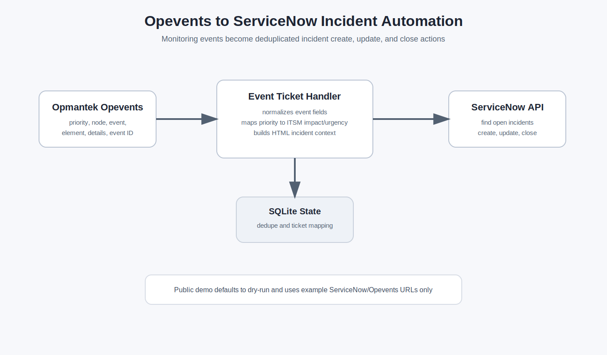

# Opevents to ServiceNow Incident Automation

A public-safe portfolio project that demonstrates how monitoring events from Opmantek Opevents can drive ServiceNow incident lifecycle automation.

The original private scripts handled live Opevents arguments, ServiceNow incident creation, duplicate detection, repeated-event updates, and recovery-event closure. This repo keeps that workflow while removing real domains, Basic auth headers, account IDs, assignment groups, node names, local paths, and runtime databases.



## What It Demonstrates

- Parsing Opevents action arguments from a monitoring event.
- Mapping Opevents priority to ServiceNow impact, urgency, and priority.
- Creating HTML incident descriptions with event context links.
- Checking for existing open incidents before creating new ones.
- Updating an existing incident when an event repeats.
- Closing incidents when matching recovery events arrive.
- Tracking event-to-incident state in SQLite for local deduplication.
- Dry-run behavior by default for safe demos.

## Event Flow

```text
Opevents event action
        |
        v
CLI handler receives priority/details/tag/node/event/element/time/event_id
        |
        v
Local dedupe and priority mapping
        |
        v
ServiceNow API find/create/update/close
        |
        v
SQLite state records event-to-incident relationship
```

## Repository Layout

```text
.
|-- config/priority_map.csv
|-- docs/opevents-servicenow-flow.svg
|-- src/opevents_snow/
|   |-- cli.py
|   |-- description.py
|   |-- handler.py
|   |-- models.py
|   |-- priority.py
|   |-- recovery.py
|   |-- servicenow.py
|   `-- state_store.py
|-- tests/
|-- .env.example
|-- README.md
|-- pyproject.toml
`-- requirements.txt
```

## Quick Start

```bash
python3 -m venv .venv
source .venv/bin/activate
pip install -r requirements.txt
cp .env.example .env
```

The default `.env.example` keeps `DRY_RUN=true`, so API calls are printed/simulated instead of sent.

## Example Opevents Calls

Open or update an incident:

```bash
PYTHONPATH=src python -m opevents_snow.cli open-update \
  8 \
  "Interface ge-0/0/0 is down" \
  "servicenow,core" \
  "edge-router-01" \
  "Node Down" \
  "ge-0/0/0" \
  "1710000000" \
  "12345"
```

Close a recovered incident:

```bash
PYTHONPATH=src python -m opevents_snow.cli close \
  8 \
  "Node recovered" \
  "servicenow,core" \
  "edge-router-01" \
  "Node Up" \
  "system" \
  "1710000300" \
  "12346"
```

## Configuration

Environment variables:

```text
SERVICENOW_INSTANCE_URL=https://example.service-now.com
SERVICENOW_USERNAME=replace-in-lab
SERVICENOW_PASSWORD=replace-in-lab
SERVICENOW_ACCOUNT_ID=00000
SERVICENOW_CREATED_BY=automation@example.com
SERVICENOW_ASSIGNMENT_GROUP=Network Operations
OPEVENTS_BASE_URL=https://opevents.example.invalid/en/omk/opEvents
STATE_DB_PATH=artifacts/opevents_snow_state.db
DRY_RUN=true
```

Priority mapping lives in `config/priority_map.csv`.

## Tests

```bash
PYTHONPATH=src pytest
```

## Sanitization Notes

- No real ServiceNow instance URLs are included.
- No Basic auth headers, usernames, passwords, account IDs, or assignment group email addresses are included.
- No real Opevents hostnames or internal event context URLs are included.
- No original `nodes_data.json`, `core_devices_data.json`, runtime DB, virtualenv, `.bak`, or cache files are included.
- Example nodes, URLs, event IDs, and timestamps are synthetic.
